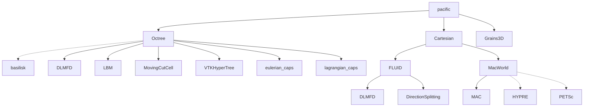

# Welcome to PacIFiC!

PacIFiC is a high-performance MPI parallel c/c++ software to compute particle-laden flows at the particle scale. PacIFiC stands for "PArtiCles In FluId Computations".

PacIFiC is open-sourced under the MIT license, and is developed by the research group of Prof. Anthony Wachs at the University of British Columbia, Vancouver, Canada with the support of IFP Energies nouvelles, France.



Documentation will come soon.

## CMake Installation

### Requirements

For RPM-based distributions
```
  sudo dnf install 
```

### Build
```
mkdir -p build
cd build
cmake .. && make
```

