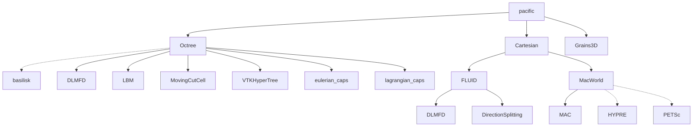

# Welcome to PacIFiC!
[](https://copr.fedorainfracloud.org/coprs/colive/PacIFiC/package/pacific/)

PacIFiC is a high-performance MPI parallel c/c++ software to compute particle-laden flows at the particle scale. PacIFiC stands for "PArtiCles In FluId Computations".

PacIFiC is open-sourced under the MIT license, and is developed by the research group of Prof. Anthony Wachs at the University of British Columbia, Vancouver, Canada with the support of IFP Energies nouvelles, France.




## Install

### Packages

### Fedora

On an RPM-based distro you may install from our [copr repo](https://copr.fedorainfracloud.org/coprs/colive/PacIFiC/):
```bash
sudo dnf copr enable colive/PacIFiC 
sudo dnf install -y pacific-openmpi pacific-openmpi-devel
```
Installation on Enterprise Linux requires the `copr` plugin in addition to CodeReady Builder (CRB) and EPEL release repositories, if they have not already been enabled.

Since RPM-based distros require installation under `/usr/lib64/openmpi/` or similar, you will need to run
```bash
source /etc/profile.d/modules.sh
module load mpi/openmpi-x86_64
```
Then our MPI-linked libraries and binaries become availible under `$PATH`, `$LD_LIBRARY_PATH` as well as the include path from `mpicc --showme`. You should now be able to run ``grains --version``. 

### Ubuntu

On Ubuntu, you may install from our [ppa archive](https://launchpad.net/~colive/+archive/ubuntu/pacific).
```bash
sudo apt-add-repository ppa:colive/pacific
sudo apt update
sudo apt install pacific-basilisk pacific-tools libpacific-mpi-dev
```
### Apptainer

Sample container definitions may be found under `apptainer`. These images are ideal for situations where your HPC cluster may not offer some of the dependencies but do offer an apptainer module.

## Building 

### Requirements

The following depenencies are required:

 * [OpenMPI](https://www.open-mpi.org/)
 * [Xerces-C++](https://xerces.apache.org/xerces-c/)
 * [zlib](https://www.zlib.net/)

In addition, the following toolchain is required or reccomended
 * [GCC](https://gcc.gnu.org/)  
 * [CMake](https://cmake.org/)
 * [Make](https://www.gnu.org/software/make/)

On RPM-based distributions (e.g. RedHat, Fedora) these can be obtained using 
```bash
sudo dnf install -y gcc g++ make cmake git openmpi-devel xerces-c-devel zlib-ng-devel hdf5-openmpi-devel
```
On apt-based distributions (e.g. Ubuntu, Debian), use
```bash
sudo apt-get install -y build-essential make cmake git libopenmpi-dev libxerces-c-dev zlib1g-dev libhdf5-openmpi-dev
```

### Building with CMake

The PacIFiC project requires the CMake meta-build tool and a build tool. We will use ninja here. 

First, create a build directory where you would like to build the system. Here, we will create a build folder in the PacIFiC root folder: To do so, configure and generate the build system by running

```bash
cmake -S . -B build-release -DCMAKE_BUILD_TYPE=Release
```

To build all targets in the project, simply run

```bash
cmake --build build-release --parallel
```
### Installing From Source 

If you wish to install to your system, run

```bash
sudo cmake --build build --target install
```

## Examples

Some examples may be found in `examples`: These can be relocated, and by default, use `FetchContent` to include copies of PacIFiC into their own build tree automatically. They therefore do not require installation of PacIFiC, although they still assume the project dependencies are installed.

## Building on HPC

### Sockeye

CMake presets are provided to help build on `sockeye.arc.ubc.ca`. It is reccomended to build inside of the compute nodes, which are offline. Since these do not have internet access, we must use git submodules to recursively clone the submodules in `third_party` to ensure they are available at configure and build time. 

Start by cloning the submodule into scratch
```bash
cd ~/scratch/user
git clone https://github.com/anthonywachs/PacIFiC.git --recurse-submodules
```
Next, start an interactive shell 
```bash
srun --pty -A st-wachs-1 -p interactive_cpu -t 00:10:00 -N 1 -c 8 --mem=16G bash -l
```
Inside the compute node, run
```bash
module load gcc cmake
cmake --preset SockeyeRelease
cmake --build --preset SockeyeRelease
cmake --install build/sockeye_release
exit
```
Now that you are off the compute node, the installed files (including XercesC) now live inside `~/scratch/user/PacIFiC/install/sockeye_release`. You may relocate this if you'd like with 
```bash
mv ~/scratch/user/PacIFiC ~/project/user
```
By default, the binaries and libraries are not yet availible on `$PATH` or `$LD_LIBRARY_PATH`. You may either `export` these manually to add them, or alternatively, write a `lmod` file such as 
```lua
whatis("Name : PacIFiC")
whatis("Version : 0.0.1")
whatis("Target : skylake_avx512")
whatis("Short description : Particles In Fluid Computations ")
help([[Name   : PacIFiC]])
help([[Version: 0.0.1]])
help([[Target : skylake_avx512]])
help([[.]])
depends_on("gcc/9.4.0")
depends_on("zlib-ng/2.0.7")
depends_on("openmpi/4.1.1-cuda11-3")
depends_on("hdf5/1.10.7-additional-bindings")
prepend_path{"PATH","/home/user/project/user/PacIFiC/install/sockeye_release/bin",delim=":"}
prepend_path{"CMAKE_PREFIX_PATH","/home/user/project/user/PacIFiC/install/sockeye_release/.",delim=":"}
append_path{"LD_LIBRARY_PATH","/home/user/project/user/PacIFiC/install/sockeye_release/lib64",delim=":"}
setenv("UBC_CLUSTER","sockeye")
```
and saving this to `$HOME/project/user/modules/PacIFiC/0.0.1.lua`. This can then be used in slurm jobs by calling 
```bash
module use "$HOME/project/user/modules"
module load PacIFiC/0.0.1
```

## Documentation

Additional documentation may be found by visiting the [documentation website](https://anthonywachs.github.io/PacIFiC/).
