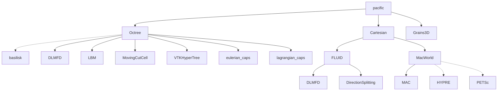

# Welcome to PacIFiC!

PacIFiC is a high-performance MPI parallel c/c++ software to compute particle-laden flows at the particle scale. PacIFiC stands for "PArtiCles In FluId Computations".

PacIFiC is open-sourced under the MIT license, and is developed by the research group of Prof. Anthony Wachs at the University of British Columbia, Vancouver, Canada with the support of IFP Energies nouvelles, France.



Documentation will come soon.


## Requirements

The following depenencies are required:

 * [OpenMPI](https://www.open-mpi.org/)
 * [Xerces-C++](https://xerces.apache.org/xerces-c/)
 * [zlib](https://www.zlib.net/)

In addition, the following toolchain is required or reccomended
 * [GCC](https://gcc.gnu.org/) (Reccomended for Basilisk/Octree)
 * [CMake](https://cmake.org/)
 * [Make](https://www.gnu.org/software/make/)

On RPM-based distributions (e.g. RedHat, Fedora) these can be obtained using 
```bash
sudo dnf install -y gcc g++ make cmake git openmpi-devel xerces-c-devel zlib-ng-devel hdf5-openmpi-devel
```
On apt-based distributions (e.g. Ubuntu, Debian), use
```bash
sudo apt-get install -y build-essential make cmake git libopenmpi-dev libxerces-c-dev zlib1g-dev libhdf5-openmpi-dev
```

## Building with CMake

The PacIFiC project requires the CMake meta-build tool and a build tool. We will use ninja here. 

First, create a build directory where you would like to build the system. Here, we will create a build folder in the PacIFiC root folder: To do so, configure and generate the build system by running

```bash
cmake -S . -B build-release -DCMAKE_BUILD_TYPE=Release
```

To build all targets in the project, simply run

```bash
cmake --build build-release --parallel
```

### Install

If you wish to install to your system, run

```bash
sudo cmake --build build --target install
```

## Documentation

Additional documentation may be found by visiting the [documentation website](https://anthonywachs.github.io/PacIFiC/).
