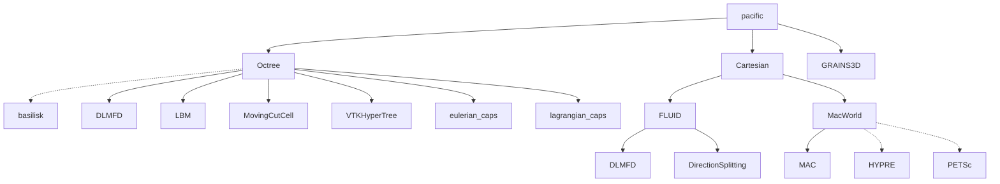

# Welcome to PacIFiC!

PacIFiC is a high-performance MPI parallel c/c++ software to compute particle-laden flows at the particle scale. PacIFiC stands for "PArtiCle In FluId Computations".

PacIFiC is open-sourced under the [MIT license](https://gitlab.math.ubc.ca/pacific-devel-team/pacific/-/blob/7e0f1f99b67e19bbf5d24b87cb59c85b1d7a66cd/LICENSE).



Documentation will come soon.

<!--
## I. Installation
There are few steps that need to be done before you can enjoy a functional installation of Pacific. First, check the installation of OpenMPI, GCC, GFORTAN, libfortran, libblas, libaltas, liblapack and libm before providing the correct path in environment file. It's important to install libfortran before building OpenMPI.
Some ARC systems may require special commands for the environemnt variables. Please refer to Wiki page to check few examples for setting-up a environment variables. Now follow the guide once completing the preliminary steps !!!

### 1. Provide paths for your libraries in the environment file
```
cp Env/PacIFiC_env_template.env.sh Env/PacIFiC-temporary-env-file.env.sh
```

Modify the file `Env/PacIFiC-temporary-env-file.env.sh` by replacing every part in between the `#`. Note that if there is a space in the path leading to the pacific folder, the routines below will most likely fail.

Having modified the `Env/PacIFiC-temporary-env-file.env.sh` file, type the following:

```
cd Env
source PacIFiC-temporary-env-file.env.sh
mv PacIFiC-temporary-env-file.env.sh PacIFiC-${PACIFIC_MPI_DISTRIB}-${PACIFIC_MPI_VERSION}-${PACIFIC_SERCOMPIL_ENV}-${PACIFIC_SERCOMPIL_VERSION}.env.sh
source PacIFiC-${PACIFIC_MPI_DISTRIB}-${PACIFIC_MPI_VERSION}-${PACIFIC_SERCOMPIL_ENV}-${PACIFIC_SERCOMPIL_VERSION}.env.sh
```

### 2. Install HYPRE and PETSc
HYPRE and PETSc are high-performace libraries that offer a wide range of state-of-the-art tools for linear algebra and multigrid solvers. In Pacific, we suggest you get HYPRE 2.10.1 and PETSc 3.2.0.

To install HYPRE 2.10.1, copy and paste the following:
```
cd $MACWORLD_ROOT
wget https://github.com/hypre-space/hypre/archive/refs/tags/v2.10.1.zip
unzip v2.10.1.zip
cd hypre-2.10.1/
cp ../extra_files/*hypre* ./
source ${PACIFIC_HOME}/Env/PacIFiC-${PACIFIC_MPI_DISTRIB}-${PACIFIC_MPI_VERSION}-${PACIFIC_SERCOMPIL_ENV}-${PACIFIC_SERCOMPIL_VERSION}.env.sh
./install-hypre.sh
```

Now, to install PETSc 3.2.0, copy and paste the following:
```
cd $MACWORLD_ROOT
wget http://ftp.mcs.anl.gov/pub/petsc/release-snapshots/petsc-3.2-p7.tar.gz
tar -zxvf petsc-3.2-p7.tar.gz
mv petsc-3.2-p7 petsc-3.2.0-p7
cd petsc-3.2.0-p7
cp ../extra_files/*petsc* ./
source ${PACIFIC_HOME}/Env/PacIFiC-${PACIFIC_MPI_DISTRIB}-${PACIFIC_MPI_VERSION}-${PACIFIC_SERCOMPIL_ENV}-${PACIFIC_SERCOMPIL_VERSION}.env.sh
./install-petsc.sh
```

If no error arises, you just installed the two state-of-the-art libraries for high-performance linear algebra manipulations! Just remove the compressed files:
```
cd $MACWORLD_ROOT
rm -rf v2.10.1.zip petsc-3.2-p7.tar.gz
```


### 3. Install Basilisk
Now, let's install the last dependancy: Basilisk, a high-performance multiphase CFD solver on adaptive grids.
All the instructions are extensively explained [here](https://basilisk.fr/install), but here is a summary of what you should do:

```
cd $BASILISK
[to be completed]
```


### 4. Install Grains3D
* To build the DEM solver Grains3D, assuming you do not already have Xerces 2.8.0, type:
```
cd $GRAINS_HOME
tar zxvf xerces-2-8-0.tar.gz
make install
```
It is possible that you get an error during the make install due to the missing file `zlib.h`. On Ubuntu (18.04), the development package of the zlib library can be installed with the command `sudo apt install zlib1g-dev`. Once the installation is complete, simply run the `make` command (there is no need for a make install at this point). It is also possible that the `mpicxx` executable is not found. In that case, it is most likely that the installed mpi libraries are standard. Grains3D requires the development package instead. If you use openmpi on Ubuntu (18.04), type `sudo apt install libopenmpi-dev`, and then try `make install` again.


### 5. Install Cartesian solver:
* Build the MAC library required for fluid solver using following commands:
```
cd $MACWORLD_ROOT/MAC/
source ${PACIFIC_HOME}/Env/PacIFiC-${PACIFIC_MPI_DISTRIB}-${PACIFIC_MPI_VERSION}-${PACIFIC_SERCOMPIL_ENV}-${PACIFIC_SERCOMPIL_VERSION}.env.sh
./install-mac.sh
```

* After the successful installation of MAC library, now let's install multiple numerical schemes to solve fluid:
```
cd ${PACIFIC_HOME}/Cartesian/FLUID
./compil
```
It's done, now we have a fully functional PacIFiC.

## II. Usage
To be completed soon.

## III. Useful tips
* If you are running MPI jobs on `r8k1-wachs1.math.ubc.ca`, you may want to run your mpirun command with the option `--bind-to none` to let the operating system decide how to spread the jobs on the available cores. Otherwise, you may end up with all your MPI jobs sharing the same N cores instead of making full use of the 64 cores.
* You may want to run a lot of simulations at once, and a good knowledge of bash commands will help you automatize this process. Once you have N simulation folders named "folder1", ..., "folderN" ready to go, consider "stuffing" instructions in a detached screen as follows:
 `for i in {1..N}; do screen -S simu$i -d -m; screen -r simu$i -X stuff " cd folder$i \n source [path to pacific environment file] \n grains_mpi 3 Grains/Init/insert.xml \n grains_mpi 3 Grains/Simu/simul.xml \n "; sleep 30.; done`
  where in this example, the code Grains3D is used in MPI on 3 cores twice in a row - using the `insert.xml` input file first, then the `simul.xml` input file. The `sleep` command is not necessary, but in case your simulations use a clock-generated seed for randomness (as it is the case with Grains3D in the "Aleatoire total" particle insertion mode), it ensures the same seed won't be used twice and you won't end up with N times the same simulation.
  Good practice is to be more descriptive than this example for the name of your screen session and simulation folders, for instance "dam_break_aspect_ratio_$i" instead of "simu$i" and "folder$i".
-->
