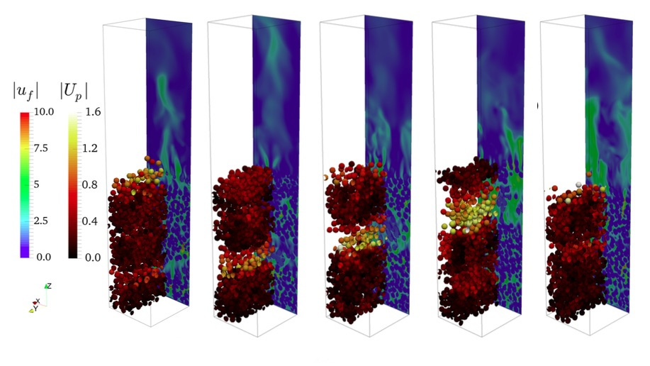

# Gallery 

Lorem ipsum dolor sit amet consectetur adipiscing elit. Quisque faucibus ex sapien vitae pellentesque sem placerat. In id cursus mi pretium tellus duis convallis. Tempus leo eu aenean sed diam urna tempor. Pulvinar vivamus fringilla lacus nec metus bibendum egestas. Iaculis massa nisl malesuada lacinia integer nunc posuere. Ut hendrerit semper vel class aptent taciti sociosqu. Ad litora torquent per conubia nostra inceptos himenaeos.

## Markdown Image

## Bootstrap HTML Figure

<figure class="figure">
   
  <figcaption class="figure-caption">A caption for the above image.</figcaption>
</figure>

## Bootstrap HTML Carousel

  

    <button type="button" data-bs-target="#carouselExampleIndicators" data-bs-slide-to="0" class="active" aria-current="true" aria-label="Slide 1"></button>
    <button type="button" data-bs-target="#carouselExampleIndicators" data-bs-slide-to="1" aria-label="Slide 2"></button>
    <button type="button" data-bs-target="#carouselExampleIndicators" data-bs-slide-to="2" aria-label="Slide 3"></button>
  

  

    

      
    

    

      
    

    

      
    

  

  <button class="carousel-control-prev" type="button" data-bs-target="#carouselExampleIndicators" data-bs-slide="prev">
    
    Previous
  </button>
  <button class="carousel-control-next" type="button" data-bs-target="#carouselExampleIndicators" data-bs-slide="next">
    
    Next
  </button>

